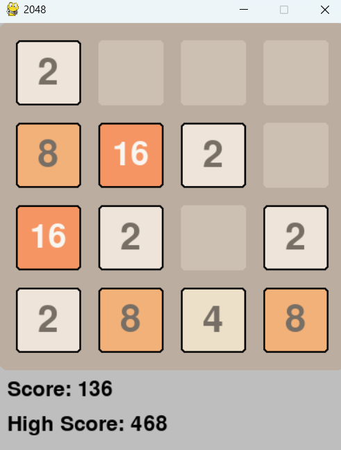

# 2048 Game  

A classic 2048 game with a simple and user-friendly interface.  

## 📜 Description  

2048 is a puzzle game where you combine numbered tiles on a 4x4 grid to reach the 2048 tile. With each move, a new tile (2 or 4) appears on the board. The goal is to merge tiles of the same value by moving them up, down, left, or right.  

## ✨ Features  

- Minimalist and intuitive UI  
- Fully functional 2048 gameplay  
- Saves and displays the current score and high score  

## 🎮 How to Play  

- Use the arrow keys (↑, ↓, ←, →) to slide the tiles.  
- Tiles with the same number merge into one when they collide.  
- The game ends when no more moves are possible.  
- The objective is to create a tile with the value **2048**! 
